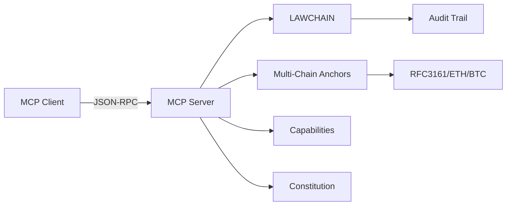

# VaultMesh Architect MCP

[](https://github.com/VaultSovereign/vaultmesh-architect-mcp/actions/workflows/mcp-tests.yml)
[](https://github.com/VaultSovereign/vaultmesh-architect-mcp/actions/workflows/link-check.yml)
[](https://github.com/VaultSovereign/vaultmesh-architect-mcp/actions/workflows/verify-docs.yml)
[](https://opensource.org/licenses/ISC)

> A Model Context Protocol (MCP) server that transforms AI-assisted development into auditable, governable, and secure architecture-as-code.

## What is VaultMesh Architect?

VaultMesh Architect is an MCP server that exposes subsystem orchestration, multi-chain anchoring, governance workflows, and capability management as explicit, auditable tools. Every architectural decision is cryptographically signed and can be anchored across multiple blockchains for tamper-proof verification.

**Key Features:**
- 🏛️ **Constitution-Driven Governance** - Formal, auditable policy framework
- 🔐 **Capability-Based Security** - Fine-grained, revocable access control
- ⚓ **Multi-Chain Anchoring** - RFC 3161, Ethereum, and Bitcoin timestamping
- 🔍 **Immutable Audit Trail** - LAWCHAIN governance ledger
- 🛡️ **Threat Modeling Integration** - Automated defensive capability generation
- 🔄 **Phoenix Resilience** - Self-healing system monitoring

## Architecture



**[📖 Read Full Architecture Overview →](docs/overview.md)**

## Who is This For?

### Builders
- Cloud architects designing secure, auditable systems
- DevOps engineers implementing governance-as-code
- Security engineers integrating threat modeling

### Reviewers
- Auditors verifying architectural decisions
- Compliance officers tracking policy adherence
- Security researchers analyzing system designs

### Partners
- Organizations requiring provable architecture
- Teams collaborating on sensitive infrastructure
- Projects needing immutable decision records

## Quick Start

### Prerequisites
- Node.js 18 or higher
- npm 9 or higher

### Installation

```bash
# Clone the repository
git clone https://github.com/VaultSovereign/vaultmesh-architect-mcp.git
cd vaultmesh-architect-mcp

# Install dependencies
npm install

# Run tests to verify setup
npm test
```

### Running the Server

```bash
# Start MCP server on stdio
npm start -- --stdio
```

### Configure with Claude Desktop

Add to your Claude Desktop configuration:

```json
{
  "mcpServers": {
    "vaultmesh-architect": {
      "command": "node",
      "args": ["server.js", "--stdio"],
      "cwd": "/path/to/vaultmesh-architect-mcp"
    }
  }
}
```

## Example Workflows

### Generate a New Subsystem
```javascript
// Spawn a new microservice with governance tracking
spawn_subsystem("auth-service", "Heart", true)
// Creates: k8s manifest + Rust crate + LAWCHAIN entry
```

### Anchor an Architecture Decision
```javascript
// Compute repository hash manifest
compute_merkle_root(root: ".", out: "manifests/hash-manifest.json")

// Anchor to multiple chains
multi_anchor(manifestPath: "manifests/hash-manifest.json")
// Returns: RFC3161 + Ethereum + Bitcoin receipts
```

### Amend the Constitution
```bash
# Interactive amendment workflow
bash scripts/amend_constitution.sh --reason "update security policy" --apply
```

### Issue a Capability
```javascript
// Issue time-limited, signed capability
issue_capability(
  subject: "service:auth",
  scopes: ["read:users", "write:sessions"],
  ttlSeconds: 3600
)
```

## What's NOT in This Repository

This is an **architecture and documentation** repository focused on design, specifications, and governance frameworks.

**You will NOT find here:**
- Production secrets or credentials
- Infrastructure configuration files
- Private operational data
- Internal IP addresses or hostnames
- Live system endpoints

For operational deployment, see our private infrastructure repository (access restricted).

## Documentation

- **[Architecture Overview](docs/overview.md)** - System design and components
- **[Contributing Guide](CONTRIBUTING.md)** - How to contribute
- **[Security Policy](SECURITY.md)** - Reporting vulnerabilities
- **[Code of Conduct](CODE_OF_CONDUCT.md)** - Community guidelines
- **[Changelog](CHANGELOG.md)** - Version history

## Core Concepts

### LAWCHAIN
An immutable governance ledger that records all architectural decisions, constitution amendments, and capability issuances with Ed25519 signatures.

### Constitution
A formal YAML document defining system policies, which can only be amended through a structured approval process with multi-chain anchoring.

### Capabilities
Cryptographically signed, time-limited tokens that grant specific permissions, replacing traditional role-based access control.

### Multi-Chain Anchoring
Artifacts are timestamped across RFC 3161 TSA, Ethereum, and Bitcoin for maximum tamper resistance and verifiability.

### Tem Integration
Threat modeling framework that transmutes security threats into defensive capabilities with automated remediation.

## Security

### Safe Defaults
- ✅ `DRY_RUN=true` by default (no actual chain interactions)
- ✅ Ephemeral keys for development
- ✅ Secret masking in all outputs
- ✅ Stdio-only communication (no network exposure)

### Reporting Security Issues
Please see our [Security Policy](SECURITY.md) for responsible disclosure guidelines.

**Do NOT open public issues for security vulnerabilities.**

## Development

```bash
# Run tests
npm test

# Run tests in watch mode
npm run test:watch

# Generate coverage report
npm run coverage

# View coverage
npm run coverage:open
```

## Governance Checks

| Check | Purpose | Badge |
|-------|---------|-------|
| Tests | Unit + E2E validation |  |
| CLI Dry-Run | Amendment ritual canary |  |
| Release Proof | Artifact hash anchoring |  |
| Phoenix Verification | Resilience health checks |  |
| Link Check | Documentation hygiene |  |

## Roadmap

- [ ] Web UI for constitution management
- [ ] Additional blockchain anchoring options (Solana, Cosmos)
- [ ] Enhanced Tem threat library
- [ ] GraphQL query interface for LAWCHAIN
- [ ] Integration with popular CI/CD platforms
- [ ] Docker container distribution

See [GitHub Issues](https://github.com/VaultSovereign/vaultmesh-architect-mcp/issues) for detailed planning.

## Contributing

We welcome contributions! Please see:
1. [Contributing Guide](CONTRIBUTING.md) for development workflow
2. [Code of Conduct](CODE_OF_CONDUCT.md) for community standards
3. [Good First Issues](https://github.com/VaultSovereign/vaultmesh-architect-mcp/labels/good%20first%20issue) for newcomers

## License

This project is licensed under the ISC License - see [LICENSE](LICENSE) for details.

## Contact & Support

- **Issues:** [GitHub Issues](https://github.com/VaultSovereign/vaultmesh-architect-mcp/issues)
- **Discussions:** [GitHub Discussions](https://github.com/VaultSovereign/vaultmesh-architect-mcp/discussions)
- **Security:** See [SECURITY.md](SECURITY.md)

## Acknowledgments

- [Model Context Protocol](https://modelcontextprotocol.io/) by Anthropic
- [Ed25519 signatures](https://ed25519.cr.yp.to/) for LAWCHAIN
- Contributors and community members

---

**Built with ❤️ by the VaultSovereign team**

*VaultMesh Architect: Making architecture auditable, one commit at a time.*
