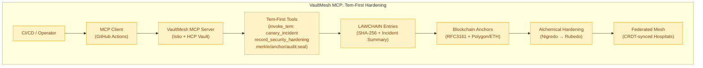

# Digital Twin Architecture: Security Automation (Tem‑First) with VaultMesh MCP

Overview: The Tem‑First Security Automation track is wired end‑to‑end via VaultMesh MCP, enabling one‑command reproducible hardening of healthcare digital twins. It uses `invoke_tem` for safe incident simulation, `record_security_hardening` for LAWCHAIN provenance, and `audit:seal` for anchored forensic reports—supporting zero‑trust, auditable evolution from Nigredo (vulnerable) to Rubedo (hardened).

---

#### VaultMesh MCP Flowchart (Tem‑First Security Automation)



---

#### Reference Architecture: Healthcare Twin with Tem‑First Security

```mermaid
flowchart LR
    CI[GitHub Actions<br/>(Nightly Canary)] -->|dispatch| MCP_Client[MCP Client]
    MCP_Client -->|initialize| VaultMesh[VaultMesh MCP Server]
    VaultMesh -->|invoke_tem| Canary[Canary Incidents<br/>(Simulated: PHI leak, DDoS)]
    Canary -->|record_security_hardening| LAWCHAIN[LAWCHAIN<br/>(Incident Roll-up)]
    LAWCHAIN -->|multi_anchor| Polygon[Polygon Anchor]
    VaultMesh -->|npm run merkle| Merkle[hash-manifest.json]
    Merkle -->|npm run anchor| Polygon
    VaultMesh -->|npm run audit:seal| Audit[forensic_report.md<br/>+ audit_YYYY-MM-DD.json]
    Polygon -->|CRDT Sync| Mesh[Federated Hospital Mesh]
    Mesh -->|Hardened State| Dashboard[Operator Console]
```

Components
- `invoke_tem`: safe canary incidents (mock PHI exfiltration, IoT spoof).
- `record_security_hardening(summary?)`: LAWCHAIN roll‑up with SHA‑256.
- `writeAnchorReceipts`: shared helper for `multi_anchor` and `audit:seal`.
- `governance/scripts/audit_seal.js`: timestamped, Merkle‑rooted audit bundle.

Standards
- GDPR Art.9 (health data breach logging), NIS2 Art.21 (24h incident reporting), AI Act Art.10 (provenance), ISO/IEC 27001 A.12.4 (event logging).

How to use
- Fresh state proof: `npm run merkle && npm run anchor`
- Canary + hardening: `npm run tem:canary`
- Live anchor (secrets set): `DRY_RUN=false npm run audit:seal`

KPIs (targets)
- Canary detection 100%, roll‑up <90s, Polygon finality <3s, 100% Merkle‑verified audits, nightly cycle → Rubedo <24h.

