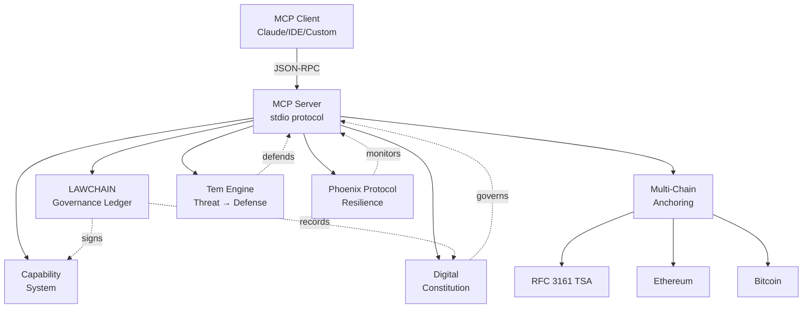

# VaultMesh Architect - Architecture Overview

## What is VaultMesh Architect?

VaultMesh Architect is a Model Context Protocol (MCP) server that provides architecture-as-code capabilities for building secure, auditable, and governable distributed systems. It exposes subsystem orchestration, multi-chain anchoring, governance workflows, and capability management as explicit, auditable tools.

## Architecture Philosophy

VaultMesh follows these core principles:

### 1. **Auditable by Design**
Every action produces cryptographically signed records in LAWCHAIN, creating an immutable audit trail of all architectural decisions and changes.

### 2. **Constitution-Driven Governance**
The system is governed by a formal constitution that can be amended through a structured approval process, with all changes anchored across multiple blockchains.

### 3. **Security First**
- Operates in dry-run mode by default
- Secrets are masked in logs
- Ephemeral keys for development
- No network exposure (stdio communication)

### 4. **Capability-Based**
Fine-grained, revocable capabilities replace traditional role-based access control, with each capability cryptographically signed and time-limited.

## Core Components

### MCP Server
The heart of VaultMesh Architect is an MCP server that communicates over stdio, making it compatible with any MCP-enabled client (like Claude Desktop, IDEs, or custom tools).

### LAWCHAIN
A governance ledger that records:
- Subsystem spawning events
- Constitution amendments
- Capability issuances
- Merkle root anchors
- Audit events

All entries are Ed25519-signed for authenticity.

### Multi-Chain Anchoring
Architecture artifacts can be anchored to multiple chains for tamper-proof timestamping:
- **RFC 3161 TSA:** Traditional timestamping
- **Ethereum:** Public blockchain anchor
- **Bitcoin:** Maximum decentralization anchor

### Tem Integration
Threat modeling and defensive capability generation through the Tem alchemical framework, supporting both Python and Rust implementations.

### Phoenix Resilience Protocol
A capability-based resilience framework that monitors system health and automatically applies remediation when canary events are detected.

## Architecture Diagram



## Key Capabilities

### 1. Subsystem Spawning
Generate Kubernetes manifests and Rust crate skeletons for new subsystems with governance tracking:

```javascript
spawn_subsystem(name, organType, rust=true)
```

### 2. Merkle Root Computation
Create cryptographic manifests of repository state:

```javascript
compute_merkle_root(root=".", out="manifests/hash-manifest.json")
```

### 3. Multi-Chain Anchoring
Anchor artifacts across multiple chains with consolidated receipts:

```javascript
multi_anchor(manifestPath)
```

### 4. Constitution Management
Read, propose, and amend the governance constitution:

```javascript
// Read constitution
resources/read("spec://digital-twin/constitution")

// Propose amendment
propose_charter(replacement_yaml, note)

// Approve and apply
approve_charter(proposal_id, approver, apply_update)
```

### 5. Capability Issuance
Issue signed, time-limited capabilities:

```javascript
issue_capability(subject, scopes, ttlSeconds)
```

### 6. Threat Transmutation
Convert threats into defensive capabilities via Tem:

```javascript
invoke_tem(threatType, realm, autoRemediate, lastGoodRoot)
```

### 7. Alchemical Phase Management
Track system evolution through Nigredo → Albedo → Citrinitas → Rubedo:

```javascript
get_phase(realm)
evolve_phase(realm, action)
```

## Data Flow

### 1. Architecture Change
```
Developer → MCP Client → MCP Server → LAWCHAIN Entry
                                    → Kubernetes Manifest
                                    → Capability Token
```

### 2. Constitution Amendment
```
Proposal → Approval → LAWCHAIN Charter → Constitution Update
                                        → Multi-Chain Anchor
```

### 3. Threat Response
```
Threat Detected → Tem Analysis → Defensive Capability → Auto-Remediation
                                                       → LAWCHAIN Log
```

### 4. Release Verification
```
Release Tag → Tarball → Checksum → Merkle Root → Multi-Chain Anchor
                                                → LAWCHAIN Proof
```

## Security Model

### Default Safe
- **DRY_RUN=true** by default - no actual chain interactions
- **Ephemeral keys** if none provided
- **Stdio only** - no network ports exposed
- **Secret masking** in all outputs

### Production Hardening
When `DRY_RUN=false`:
- Requires explicit configuration
- Validates all endpoints
- Enforces key management
- Produces verifiable receipts

### Audit Trail
Every action produces:
1. LAWCHAIN entry with signature
2. Timestamp and context
3. Cryptographic proof
4. Human-readable log

## Use Cases

### 1. Cloud-Native Architecture
- Generate k8s manifests
- Track subsystem dependencies
- Anchor architecture decisions
- Audit infrastructure changes

### 2. Compliance & Governance
- Constitution-driven policies
- Immutable audit trails
- Multi-chain verification
- Capability-based access

### 3. Security Engineering
- Threat modeling integration
- Automated defense generation
- Incident response tracking
- Resilience monitoring

### 4. Release Management
- Artifact anchoring
- Checksum verification
- Provenance tracking
- Tamper detection

## Getting Started

See the [README](../README.md) for:
- Installation instructions
- Quick start guide
- Configuration options
- Example workflows

## Further Reading

- [LAWCHAIN Specification](../specs/vaultmesh_mcp_digital_twin.yaml)
- [Phoenix Resilience Protocol](../governance/capabilities/phoenix_resilience_protocol.md)
- [Constitution Management](../governance/templates/audit.md)
- [Release Notes](./releases/)

## Contributing

Want to contribute? See our [Contributing Guide](../CONTRIBUTING.md) and [Code of Conduct](../CODE_OF_CONDUCT.md).

## License

This project is licensed under the ISC License - see [LICENSE](../LICENSE) for details.
